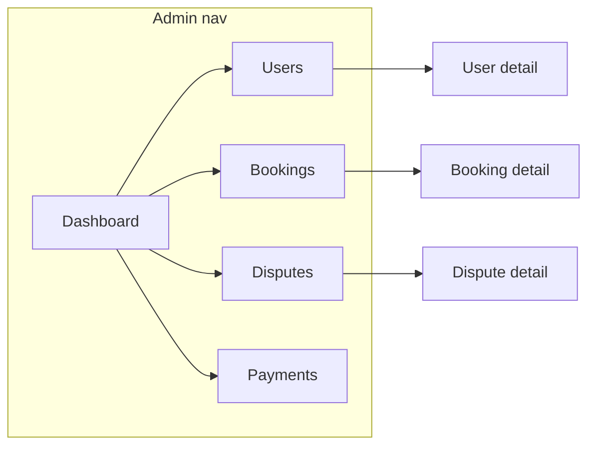

# Admin frontend operations console

## Audit verdict (reuse first)

**Keep and grow** — do not replace the route/auth shell.

| Asset | Action |
|-------|--------|
| [`frontend/src/App.jsx`](frontend/src/App.jsx), [`auth/paths.js`](frontend/src/auth/paths.js), [`auth/guards.jsx`](frontend/src/auth/guards.jsx) | Reuse routes + `RequireRole(['admin'])` |
| [`AppShell.jsx`](frontend/src/components/layout/AppShell.jsx) | Extend admin nav only (add Payments; rename Admin → Dashboard) |
| [`AdminPages.jsx`](frontend/src/pages/admin/AdminPages.jsx) | Split into focused page modules under `pages/admin/` |
| [`BookingDetailPage.jsx`](frontend/src/pages/bookings/BookingDetailPage.jsx) | Reuse as `/admin/bookings/:id`; restructure admin sections (booking / payment / escrow / payout / cancel / actions) |
| [`adminApi` / `disputesApi` / `paymentsApi`](frontend/src/api/index.js) | Reuse; add `adminApi.updateUser` for suspend/roles |
| [`bookingStatus.js`](frontend/src/domain/bookingStatus.js), [`States.jsx`](frontend/src/components/ui/States.jsx) | Non-negotiable for Issue reported vs Disputed badges |
| Backend | **No business-logic changes.** Dashboard, users, bookings, disputes, payments, audit-logs already exist |

**API gaps that constrain UI (honor, don’t invent):**

- User **list** DTO has no reliability → Reliability column on detail only; list shows Status (Active/Suspended).
- Admin **booking list** has no payment/payout → list shows booking + issue state; money columns live on detail + Payments page.
- Dashboard is coarse (`total_students`, `total_coaches`, `bookings.active`, `disputes.pending`) → “Needs attention” / “Recent activity” come from parallel list/audit fetches, not new stats endpoints.
- Dispute **resolve** stays API-only (no fake Resolve button), per your MVP rule.
- Global notifications inbox does not exist (`GET /notifications` is caller-scoped) → optional Recent activity via `GET /admin/audit-logs` on the dashboard only; no Notifications nav item.

## Target IA

**Admin mode nav:** Dashboard · Users · Bookings · Disputes · Payments  
(Settings / logout stay in account menu.)

**New route:** `/admin/payments` (+ optional `/admin/payments/:id` if detail is useful; otherwise link to booking).

## Implementation order

### 1. Shared admin chrome + API glue
- Split pages from [`AdminPages.jsx`](frontend/src/pages/admin/AdminPages.jsx) into e.g. `AdminDashboardPage.jsx`, `AdminUsersPage.jsx`, `AdminUserDetailPage.jsx`, `AdminBookingsPage.jsx`, `AdminDisputesPage.jsx`, `AdminDisputeDetailPage.jsx`, `AdminPaymentsPage.jsx`, plus thin `index.js` re-exports for `App.jsx`.
- Small shared helpers under `frontend/src/pages/admin/` or `frontend/src/domain/`:
  - `adminStatusBadges` — separate badges for booking / issue / payment / escrow / payout / dispute status (reuse `bookingDisplayLabel` for bookings).
  - Page header pattern (title + short ops subtitle + optional filters).
- Extend `adminApi`: `updateUser(id, body)`, `auditLogs(params)`. Wire `paymentsApi` into admin routes.

### 2. Dashboard (ops, not decorative)
- Top cards mapped to existing `GET /admin/dashboard` (+ one targeted pending-bookings count via `adminApi.bookings({ status: 'pending', limit: 1 })` if pagination total is available; otherwise label “Active bookings” from `bookings.active` and show pending in Needs attention).
- **Needs attention:** open/under_review disputes; pending bookings; recent cancelled (client filter or status filter); payment rows with refund/failed-ish statuses from `paymentsApi.list` when filters allow.
- **Recent activity:** `GET /admin/audit-logs?limit=20` — humanize action/table/record; link to user/booking when `table_name`/`record_id` match known entities.
- Empty/loading/error via existing `States`.

### 3. Users list + detail
- Searchable table: Name · Role(s) · Status · Joined · Actions(View).
- Filters: All / Students / Coaches / Admins via API `role` + `search`; Active / Suspended client-side on `is_active` (API has no `is_active` query).
- Detail sections: Identity · Reliability (coach/student summaries from detail DTO) · Marketplace (`coachProfile` Stripe readiness if present) · Activity (recent bookings/disputes via existing list filters `student_id`/`coach_id` / disputes by booking when practical).
- **Admin actions** visually separated: Suspend / Reactivate (`PUT is_active`); role toggles only if governance allows — use `window.confirm` for destructive actions. No raw JSON.

### 4. Bookings list + detail polish
- Filters: All + status chips matching API (`pending`, `confirmed`, `awaiting_verification` if used, `completed`, `cancelled`, `disputed`).
- Table/cards: Booking # · Student · Coach · Lesson · When · Booking status (with Issue reported via `bookingDisplayLabel`) — not a single collapsed “Status”.
- Detail: keep shared [`BookingDetailPage`](frontend/src/pages/bookings/BookingDetailPage.jsx); restructure admin view into clear blocks (Booking · Payment · Escrow · Payout · Cancellation · Admin actions). Confirm dialogs for refund/cancel; wire no-show admin actions only if product-ready (optional in same PR once confirm UX exists). Preserve Issue reported ≠ Disputed.

### 5. Disputes queue + case file
- List: prioritize Open / under_review; section or filter for Resolved; columns Dispute # · Student · Coach · Booking · Type · Created · Age · Status.
- Detail: case-file layout (issue, parties, booking link, financial snapshot from nested booking/payment, notes/evidence fields already returned). Explicit copy that resolution remains API-only — **no Resolve UI**.

### 6. Payments page (PickleCoach-centric)
- New page using `paymentsApi.list` filters (`status`, `escrow_status`, parties).
- Columns/sections: Booking · Student · Amount · Payment status · Escrow · Coach · Expected payout · Payout/transfer IDs (admin fields) · Refund.
- Visually separate payment vs escrow vs refund vs payout; never treat charge as coach payout.
- Optional detail drawer/page via `paymentsApi.getById`.

### 7. QA / tests
- Manual: every admin route as admin; student/coach → `/forbidden`; deep-link refresh; loading/empty/error; mobile nav.
- Automated: focused unit tests for admin badge/label helpers and any pure filter helpers; run existing `frontend/tests` (esp. `booking-display-labels`).
- Do not change student/coach flows except shared `BookingDetailPage` admin-aware sections.

## Out of scope (this pass)
- Fake dispute Resolve UI
- Backend state machines, Stripe logic, reliability engine
- Full audit browser / notification blast UI
- Inventing list fields (reliability on user list; payment/payout on booking list) without a deliberate follow-up DTO PR

## Success criteria
Admin mode feels like an ops console: attention-first dashboard, filterable inventory tables, case-file details, money states separated, existing APIs only, student/coach product untouched.